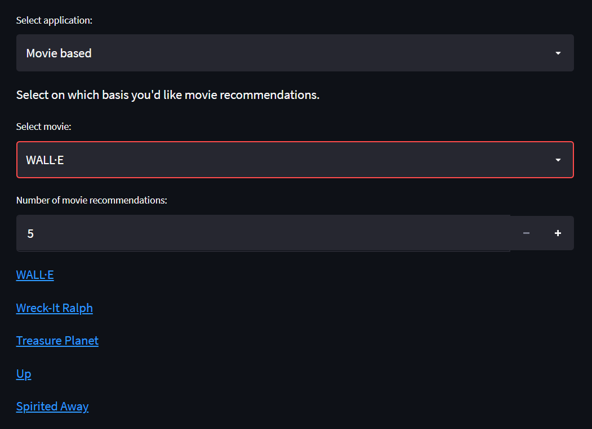

<h1 align="center">Movie Recommendation Engine 
  <!---->
</h1>
<h3 align="centre">Recliner Lounger</h3>

 <a target="_blank" href="https://share.streamlit.io/yuktika089/practise2/main/movierec_app.py">Link to the App</a>
    ·
 <a target="_blank" href="to edit">Video Demo</a>

    
<!-- TABLE OF CONTENTS -->

  
Table of Contents

  <ol>
    <li>
      <a href="#about-the-project">About The Project</a>
      <ul>
        <li><a href="#salient-features">Salient Features</a></li>
        <li><a href="#compatible-platforms">Compatible Platforms</a></li>
        <li><a href="#built-with">Built With</a></li>
      </ul>
    </li>
    <li>
      <a href="#agile-methodology">Agile Methodology</a>
      <ul>
        <li><a href="#what-is-agile">What is Agile</a></li>
        <li><a href="#how-i-incorporated-agile-methodology-during-the-development-cycle">How I Incorporated Agile Methodology During The Development Cycle</a></li>
      </ul>
    </li>
    <li>
      <a href="#getting-started">Getting Started</a>
      <ul>
        <li><a href="#prerequisites">Prerequisites</a></li>
        <li><a href="#installation">Installation</a></li>
      </ul>
    </li>
    <li><a href="#navigating-through-the-app">Navigating through the App</a></li><ul>
        <li><a href="#login">Login</a></li>
        <li><a href="#chat-window">Chat Window</a></li>
        <li><a href="#video-call">Video Call</a></li>
      </ul>
    <li><a href="#resources-used">Resources Used</a></li>
  </ol>

<!-- ABOUT THE PROJECT -->

## About The Project
* Movie Recommendation Engine project built during Microsoft Engage 2022 program. 
* It is a movie recommending application through which we can get recommendation on the basis of our favourite genres or our favourite movie. 
* The App is called "Recliner Lounge", as it gives the best recommendation for any occastion to watch a movie at our favoured comfort.

### Salient Features
* User registers through entering name.
* User can make choice of which type of recommendation they want - Movie based or Genres based.
* Recommendations are redirecting the user to its IMDB page, in order to give better user experience.
* The user can adjust the number of recommendations and the IMDB scores, to get optimum suggestions.

### Compatible Platforms
Laptops, Desktops, Tablet, PCs and Phones (Android and IOS).

### Built With

### Machine Learning in Python: 
* Libraries used - NumPy, Scikit-Learn, Matplotlib, Pandas
* Code built using - Jupytor, Google colab, Visual Studios

### App and Deployment: 
* App building - Streamlit
* Deployment - Streamlit

<!-- AGILE METHODOLOGY -->
## Agile Methodology

### Agile

Agile refers to a group of software development methodologies based on iterative development and is frequently being adopted in the software industry. Agile promotes teamwork, flexible procedures, and results in delivery of high quality software.

### How I Incorporated Agile Methodology During The Development Cycle

Scrum and kanban are the primary agile processes. SCRUM is a subset of Agile, a framework for developing software. SCRUM takes advantage of different techniques to achieve goals in Agile. I implemented scrum, which organizes the work in cadences called sprints, usually is performed on a very short time period. 

* Sprint 1 (May 4 - May 10): Exploring and understanding the different approaches 
    - Researched about different algorithms used in recommendation systems - Content-based filtering, Collaborative-based filtering and Hybrid Reccomendation approach.     - Understood the requirements for each algorithms and traversed through many datasets for the application.

* Sprint 2 (May 11 -May 17): Planning the Engine-making process and Determining the languages and softwares to utilise 
    - Researching about various Machine Learning libraries and platforms that can be used to make a recommendation system app with a minimum functionality to have content and collaborative filtering. 
    - Finalised to use Machine Learning in Python Language using Google Colab and Visual Studios.
    - Eventually utilised the movies_metadata dataset which consists of more than 5000 movies and their information.

* Sprint 3 (May 18 - May 24): Implementation of the Algorithm and Execution of the System built
    - Started the development process by taking help from YouTube tutorials. 
    - Built an web application using Streamlit for the very first time. 

* Sprint 4 (May 25 - May 29): Debugging, Deployment and Final Submission
    - Encountered occasional bugs which I debugged timely. Made required changes in the UI, added images and mode to make it user friendly. 
    - Deployemnt was a challenge as it took several debuggings to make the app available on different platforms.

<!-- INSTALLATIONS -->

## Getting Started
To run this project on your local systems, following are the requirements:

### Prerequisites and Accessing the Application
- There are no prerequisites to run the "Recliner Lounge" - Movie Recommendation Engine on your systems.
- Just simply click on the link and the engine can be used to your satisfiability. 

<!-- APP TUTORIAL-->
## Navigating Through The Web Application

### How the Web App works ?

- After the link is accesssed and the web app opens, you will come across this view.

- The very first step is required to fill your name in the space provided.

- User can select the mode of recommendation as Movie-based or Genre-based by clicking on the down arrow for 'Select Application'.

#### - Movie Based
    - If Movie-based application is selcted, then user needs to enter a movie similar to which the user will get the recommendations.

    - There are tons of options of movies of the user to choose from by clicking on the down arrow.

    - Then, for the selected movie, recommendations will be provided. The default number of recommendations is set at 5, but you may increase or decrease the number of recommendations as per your requirement.

    - The recommendations provided also enables you to check it's overview and it's trailer by clicking on the Movie you choose from the recommendations and you will be directed to its IMDB page. Here, I clicked on Wreck-it Ralph : 

#### - Genre Based

      - If Genre-based application is selected, then the user needs to select either one or more genres from the options provided.

      
      - Then you may adjust the IMDB score according to your requirement for the recommendations. Here as well, you may increase or decrease the number of recommendations you require.

      - If you click on any recommended movie, you will be directed to its IMDB page. Here, I've clicked on Sleeper :

    
#### - Additional Feature
     
      - In order to accompany your searching time, music is provided. Optional to vibe.

    

<!-- ACKNOWLEDGEMENTS -->

## Resources Used

* [Movie Recommendation System](https://youtu.be/7rEagFH9tQg)
* [2nd - Movie Recommendation System](https://youtu.be/_cXm7o9cDRo)
* [Streamlit Deployment](https://youtu.be/sO4IKex53JY)

## Resoyrces Used within the Web App 

* [1st Image in Web App](https://t3.ftcdn.net/jpg/02/85/99/48/240_F_285994803_e2kQy174bXyBFzEe4edXuw9txCoK9Xde.jpg)
* [2nd Image in Web App](https://t3.ftcdn.net/jpg/03/08/67/90/240_F_308679018_BXO8N8kgr1RhPmwDJhLUnKL40i8MSFkU.jpg)
* [Audio used](https://youtu.be/UhIte8t6BEg)
